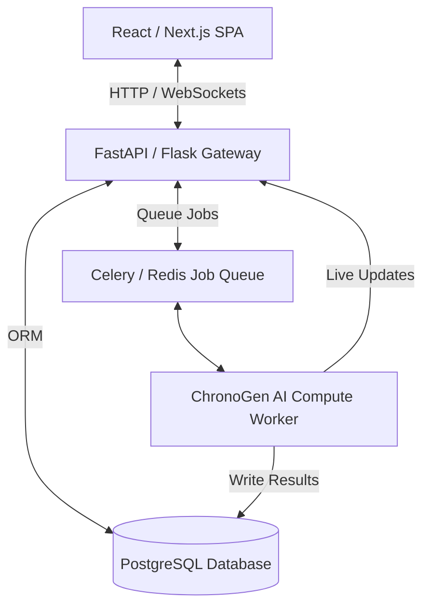

# 🚀 ChronoGen Enterprise Upgrade Proposal

To transform **ChronoGen** into a high-performance, industry-level, and enterprise-ready scheduling SaaS, we need to address architectural limitations (blocking CPU tasks, CSV storage, security) and implement advanced scheduling logic. 

Below is the blueprint to elevate ChronoGen to a state-of-the-art product.

---

## 1. Technical Stack Architecture

The current architecture is monolithic (Flask doing both API and CPU-intensive Genetic Algorithm computing in the request path). To support heavy computational loads, we must decouple the compute engine.



### Proposed Stack:
*   **Frontend:** React / Next.js + TailwindCSS + Shadcn/UI for a premium, highly responsive glassmorphism UI.
*   **State Management:** TanStack Query (React Query) for data caching + Socket.IO-client for real-time streaming.
*   **Backend API Gateway:** FastAPI (Python) for ultra-fast, async-first REST endpoints and automatic OpenAPI docs.
*   **Database:** PostgreSQL (with SQLAlchemy & Alembic for migrations) for robust relational data, replacing static CSV files.
*   **Task Queue:** Celery + Redis. This is **critical**. Running the Genetic Algorithm blocks Flask. Offloading it to background workers keeps the web app fast and responsive.

---

## 2. Relational Database Schema (PostgreSQL)

Replacing CSV files with a flexible, relational database structure allows multi-tenancy (multiple schools/departments using the system simultaneously).

```sql
-- Core Schema for Multi-Tenant ChronoGen

CREATE TABLE institutions (
    id SERIAL PRIMARY KEY,
    name VARCHAR(255) NOT NULL,
    created_at TIMESTAMP DEFAULT NOW()
);

CREATE TABLE departments (
    id SERIAL PRIMARY KEY,
    institution_id INTEGER REFERENCES institutions(id) ON DELETE CASCADE,
    name VARCHAR(100) NOT NULL
);

CREATE TABLE faculty (
    id SERIAL PRIMARY KEY,
    department_id INTEGER REFERENCES departments(id) ON DELETE CASCADE,
    name VARCHAR(255) NOT NULL,
    email VARCHAR(255) UNIQUE NOT NULL,
    available_slots JSONB NOT NULL -- E.g., {"Mon": [1, 2, 3], "Tue": [4, 5]}
);

CREATE TABLE rooms (
    id SERIAL PRIMARY KEY,
    institution_id INTEGER REFERENCES institutions(id) ON DELETE CASCADE,
    name VARCHAR(100) NOT NULL,
    capacity INTEGER NOT NULL,
    features JSONB NOT NULL -- E.g., ["projector", "computers", "chemistry_lab"]
);

CREATE TABLE courses (
    id SERIAL PRIMARY KEY,
    department_id INTEGER REFERENCES departments(id) ON DELETE CASCADE,
    name VARCHAR(255) NOT NULL,
    hours_per_week INTEGER NOT NULL,
    required_features JSONB NOT NULL -- E.g., ["computers"]
);
```

---

## 3. Algorithmic Upgrades (Memetic Optimization)

The current Genetic Algorithm (GA) is a standard genetic loop. While effective for small datasets, it struggles with thousands of courses and complex physical constraints.

### 🧬 NSGA-II/III (Multi-Objective Optimization)
Instead of a single fitness score, optimize for three distinct goals simultaneously:
1.  **Hard Constraints (Zero Violations):** No double-bookings, respect faculty availability.
2.  **Student Satisfaction:** Minimize gaps between classes (no 3-hour wait times), distribute electives evenly.
3.  **Resource Efficiency:** Maximize room occupancy, group classes in the same building to reduce transit times.

### 🧠 Memetic Algorithm (GA + Local Search)
Combine the global search of Genetic Algorithms with local search heuristics (like **Tabu Search** or **Simulated Annealing**) applied to the top 10% elite timetables. This accelerates convergence and guarantees a conflict-free solution in seconds instead of minutes.

---

## 4. Advanced Interactive Features

*   **Real-time Drag-and-Drop Validator:** If an admin manually drags a class to a different cell on the grid:
    1. The frontend queries the API validator.
    2. The engine instantly highlights other cells in **red** (clash detected), **orange** (soft constraint violation), or **green** (valid).
*   **Calendar Syncing:** Add one-click export to Google Calendar, Microsoft Outlook, and Apple Calendar via iCal (.ics) subscription links for both faculty and students.
*   **AI Chat Copilot (LLM-driven):** Integrate a Retrieval-Augmented Generation (RAG) assistant using Gemini or OpenAI APIs:
    > *"Which classrooms are free on Wednesday during Period 3?"*
    > *"Schedule an extra session for Dr. Singh in a room with at least 50 seats."*
*   **Advanced Diagnostics Dashboard:** High-fidelity analytics showing:
    *   Room utilization rates (e.g. "Seminar hall is only utilized 20% of the time").
    *   Faculty workload distribution.
    *   Carbon footprint/energy savings by consolidatng classes into fewer buildings.

---

## 5. Phase-by-Phase Roadmap

### Phase 1: Core Decoupling (1-2 Weeks)
*   Integrate SQLite with SQLAlchemy.
*   Move the Genetic Algorithm compute loop to an asynchronous background thread or process.
*   Replace standard SMTP resets with secure token-based password reset links.

### Phase 2: Interface Enhancement (2 Weeks)
*   Replace the simple CSS table with an interactive calendar grid (e.g., custom React Grid or FullCalendar).
*   Implement drag-and-drop feedback (valid vs invalid slots highlighted in real-time).

### Phase 3: Scaling & Cloud Deployment (1 Week)
*   Containerize the app with Docker.
*   Deploy PostgreSQL, Redis, and Python Celery workers.
*   Implement SSO (OAuth2 / Google Workspace login) for institutional access.
